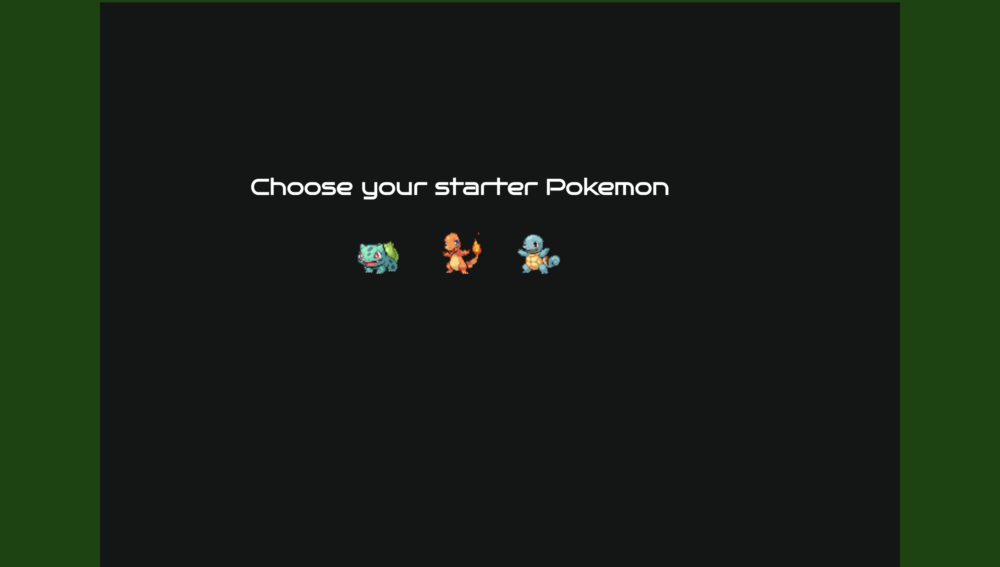
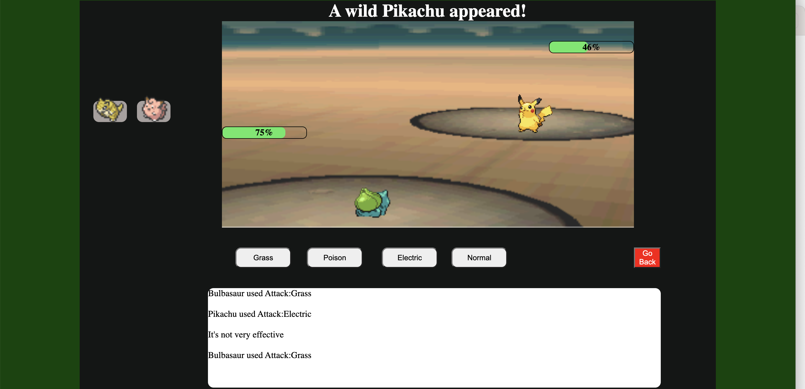
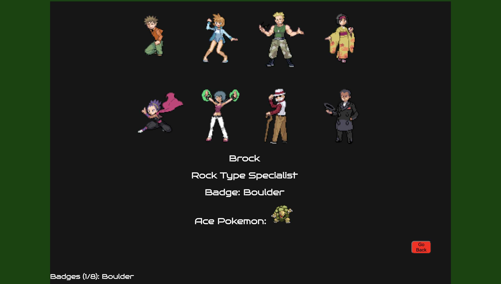
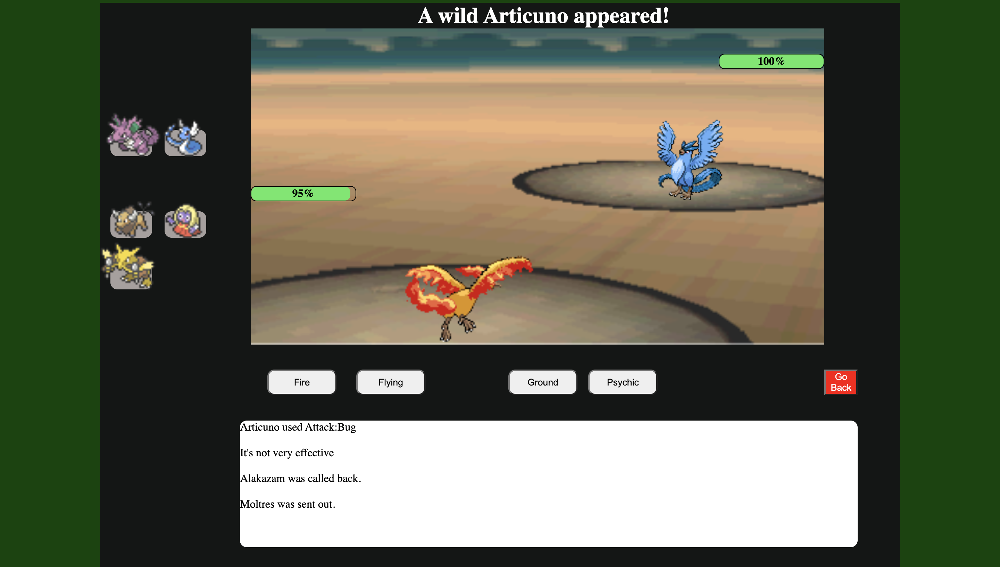
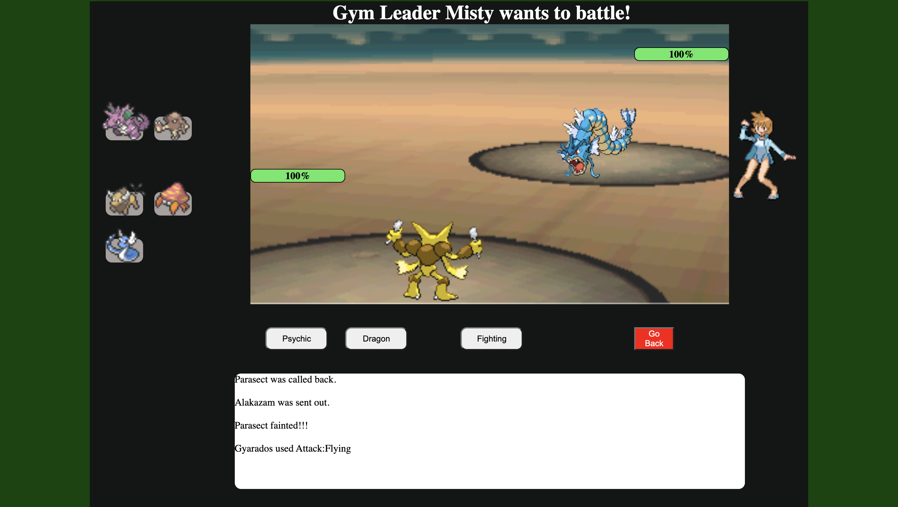

# Project 1 - Simple-Pokemon-Game

# Play Now (OLD VERSION)
https://simple-pokemon-game.netlify.app/

# New Version
GitHub Repo: https://github.com/godley0623/Pokemon-Simplified-Version

Deployed Website: https://pokemon-simplified-version.netlify.app/ 

# Project Description
A simplified version of the Pokemon Games' battle system.

# Technology USed
-HTML  
-CSS  
-Javascript  

# How to play
-Choose a starter pokemon by clicking on one of the three options.

-Battle wild pokemon to build your roster with up to six pokemon.

-Battle and defeat the eight gym leaders

# Battling
-Every attack has a 10% chance to miss.  

-Every attack has a 15% chance to be a critcial hit.  

-Follow the type matchup chart to take advantage of your opponent's weakness.

# Wild battles
-The type of pokemon that appear is tied to the number of pokemon in your party. The more pokemon you have the stronger the pokemon you will encounter.  

-Wild pokemon will gain two attacks with a random type.  

-Wild pokemon will use random attacks.

# Gym Battles
-Each Gym Leader has a full team of six pokemon.  

-Gym Leader Pokemon will always use the attack that will do the most damage against the current Pokemon.

